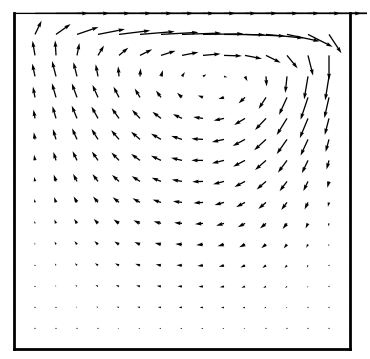
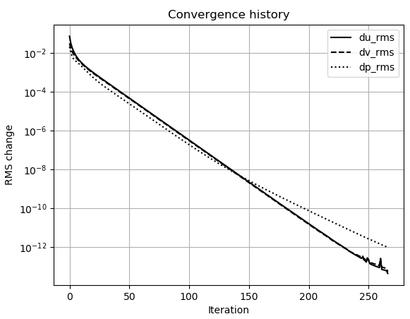
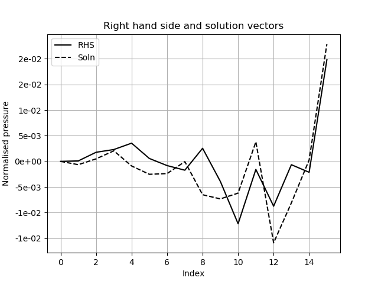
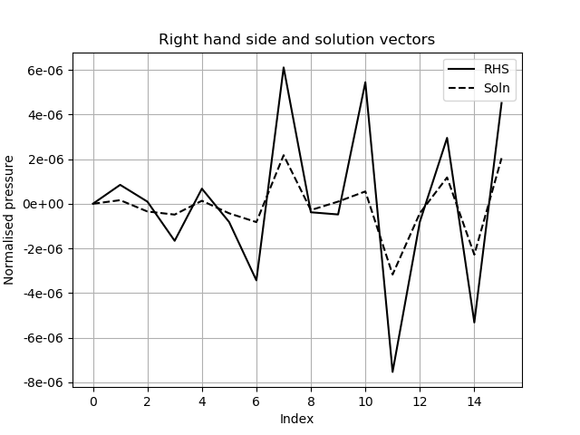
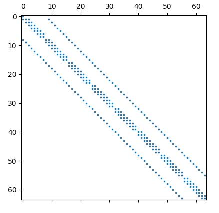

# CFD Test Matrices for Quantum Linear Equation Solvers

## Introduction

The test matrices are samples of pressure correction matrices taken from a SIMPLE (Semi Implicit Method for Pressure Linked Equations) CFD solver applied to a 2-dimensional lid driven cavity. The system to be solved is referred to as $Ax=b$, although the system being solved is for corrections and is of the form $A\delta x = \delta b$. The performance of the Quantum Linear Equation Solver (QLES) as $\delta b$ tends to machine precision is of interest.

## CFD solutions

Figures 1(a) and 1(b) show the velocity vectors and convergence history from the 17x17 mesh.

<p align = "center">
  
</p>
<p align = "center">
  <b>Figure 1(a)</b> Converged velocity vectors for 17x17 mesh.
</p>
<p align = "center">
  
</p>
<p align = "center">
  <b>Figure 1(b)</b> Convergence history for 17x17 mesh.
</p>

Two test matrices are sampled from each run of the solver after 10 and 100 iterations. Figures 2(a) and 2(b) show the right-hand side and solution vectors for the 5x5 mesh sampled after 10 and 100 iterations. Note that the 5x5 CFD mesh corresponds to a 4x4 pressure correction matrix. These vectors are included with all the test matrices.

<p align = "center">
  
</p>
<p align = "center">
  <b>Figure 2(a)</b> Right-hand side and solution vectors of the pressure correction equation after 10 iterations on the 5x5 mesh.
</p>
<p align = "center">
  
</p>
<p align = "center">
  <b>Figure 1(b)</b> Right-hand side and solution vectors of the pressure correction equation after 100 iterations on the 5x5 mesh.
</p>

## Test matrices

Table 1 gives a list of the test matrices including salient details. The table also includes an estimate of how many logical qubits would be needed to solve the matrix system using the HHL algorithm.

| CFD Mesh | PC Matrix | #non-zeros | sparsity| $\lambda$<sub>min</sub> | $\lambda$<sub>max</sub> | $\kappa$ | #HHL qubits |
| :--:  | :--:        | :--:   | :--:   | :--:    | :--:  | :--:    | :--: |
| 5x5   | 16x16       | 64     | 25.00% | 5.2E-02 | 4.54  | 8.7E+01 | 15   |
| 9x9   | 64x64       | 288    | 7.03%  | 2.7E-03 | 1.51  | 5.6E+02 | 19   |
|17x17  | 256x256     | 1,216  | 1.86%  | 1.4E-04 | 0.49  | 3.5E+03 | 24   |
|33x33  | 1,024x1,024 | 4,992  | 0.48%  | 7.3E-06 | 0.13  | 1.8E+04 | 31   |
|65x65  | 4,096x4,096 | 20,224 | 0.12%  | 3.8E-07 | 0.034 | 8.9E+04 | 37   |
<p align = "center">
  <b>Table 1</b> List of test matrices including eigen-spectra for the iteration 10 matrices, HHL estimates are for logical qubits.
</p>

All matrices have a sparsity pattern similar to that shown in Figure 3 for the 8x8 pressure correction matrix.

<p align = "center">
  
</p>
<p align = "center">
  <b>Figure 3</b> Sparsity pattern of the 8x8 pressure correction matrix.
</p>

Table 2 lists the entries of the 16x16 matrix for the 4x4 mesh. All the matrices have the structure of positive entries on the diagonal, with all the non-zero off diagonal entries being negative. Other than the first row, the sum of the entries on each row sum to zero.  All entries in the matrices have real values.  


| row/col|   0  |   1  |   2  |   3  |   4  |   5  |   6  |   7  |   8  |   9  |  10  |  11  |  12  |  13  |  14  |  15  |
| :--:   | :--: | :--: | :--: | :--: | :--: | :--: | :--: | :--: | :--: | :--: | :--: | :--: | :--: | :--: | :--: | :--: |
|**0**   | 1.34 | 0.00 | 0.00 | 0.00 | 0.00 | 0.00 | 0.00 | 0.00 | 0.00 | 0.00 | 0.00 | 0.00 | 0.00 | 0.00 | 0.00 | 0.00 |
|**1**   |-0.69 | 2.06 |-0.67 | 0.00 | 0.00 |-0.69 | 0.00 | 0.00 | 0.00 | 0.00 | 0.00 | 0.00 | 0.00 | 0.00 | 0.00 | 0.00 |
|**2**   | 0.00 |-0.67 | 2.06 |-0.67 | 0.00 | 0.00 |-0.72 | 0.00 | 0.00 | 0.00 | 0.00 | 0.00 | 0.00 | 0.00 | 0.00 | 0.00 |
|**3**   | 0.00 | 0.00 |-0.67 | 1.27 | 0.00 | 0.00 | 0.00 |-0.60 | 0.00 | 0.00 | 0.00 | 0.00 | 0.00 | 0.00 | 0.00 | 0.00 |
|**4**   |-0.65 | 0.00 | 0.00 | 0.00 | 1.85 |-0.65 | 0.00 | 0.00 |-0.55 | 0.00 | 0.00 | 0.00 | 0.00 | 0.00 | 0.00 | 0.00 |
|**5**   | 0.00 |-0.69 | 0.00 | 0.00 |-0.65 | 2.68 |-0.70 | 0.00 | 0.00 |-0.63 | 0.00 | 0.00 | 0.00 | 0.00 | 0.00 | 0.00 |
|**6**   | 0.00 | 0.00 |-0.72 | 0.00 | 0.00 |-0.70 | 2.75 |-0.64 | 0.00 | 0.00 |-0.69 | 0.00 | 0.00 | 0.00 | 0.00 | 0.00 |
|**7**   | 0.00 | 0.00 | 0.00 |-0.60 | 0.00 | 0.00 |-0.64 | 1.74 | 0.00 | 0.00 | 0.00 |-0.51 | 0.00 | 0.00 | 0.00 | 0.00 |
|**8**   | 0.00 | 0.00 | 0.00 | 0.00 |-0.55 | 0.00 | 0.00 | 0.00 | 1.70 |-0.61 | 0.00 | 0.00 |-0.55 | 0.00 | 0.00 | 0.00 |
|**9**   | 0.00 | 0.00 | 0.00 | 0.00 | 0.00 |-0.63 | 0.00 | 0.00 |-0.61 | 2.66 |-0.79 | 0.00 | 0.00 |-0.64 | 0.00 | 0.00 |
|**10**  | 0.00 | 0.00 | 0.00 | 0.00 | 0.00 | 0.00 |-0.69 | 0.00 | 0.00 |-0.79 | 2.76 |-0.61 | 0.00 | 0.00 |-0.66 | 0.00 |
|**11**  | 0.00 | 0.00 | 0.00 | 0.00 | 0.00 | 0.00 | 0.00 |-0.51 | 0.00 | 0.00 |-0.61 | 1.63 | 0.00 | 0.00 | 0.00 |-0.51 |
|**12**  | 0.00 | 0.00 | 0.00 | 0.00 | 0.00 | 0.00 | 0.00 | 0.00 |-0.55 | 0.00 | 0.00 | 0.00 | 1.01 |-0.46 | 0.00 | 0.00 |
|**13**  | 0.00 | 0.00 | 0.00 | 0.00 | 0.00 | 0.00 | 0.00 | 0.00 | 0.00 |-0.64 | 0.00 | 0.00 |-0.46 | 1.55 |-0.45 | 0.00 |
|**14**  | 0.00 | 0.00 | 0.00 | 0.00 | 0.00 | 0.00 | 0.00 | 0.00 | 0.00 | 0.00 |-0.66 | 0.00 | 0.00 |-0.45 | 1.56 |-0.45 |
|**15**  | 0.00 | 0.00 | 0.00 | 0.00 | 0.00 | 0.00 | 0.00 | 0.00 | 0.00 | 0.00 | 0.00 |-0.51 | 0.00 | 0.00 |-0.45 | 0.96 |
<p align = "center">
  <b>Table 2</b> 16x16 pressure correction matrix for the 5x5 mesh.
</p>

Other than the first row, the entries the matrices are symmetric. The underlying symmetry is a result of the finite volume discretisation of the pressure correction equation. The asymmetry is a result of the need to enforce the boundary condition:
$A_{00}x_0=0$.
This removes a degeneracy which would otherwise cause the solutions to be non-unique. This is sufficient to make the matrix non-Hermitian and, hence, the matrix equation to be solved becomes: 

$$
  \begin{pmatrix}
    0           & A \\
    A^{\dagger} & 0
  \end{pmatrix}
    \begin{pmatrix}
    0 \\
    x
  \end{pmatrix}
  =

  \begin{pmatrix}
    b \\
    0
  \end{pmatrix}
  \hspace{5em}(1)
$$
Since $A$ is a real valued matrix $A^{\dagger} = A^T$.
The matrix database includes both the original $A$ matrices and the symmetrised versions of all the CFD matrices and vectors.

## Data format

The matrices and vectors are all stored in C binary files using double precision. The matrix is stored in compressed row format with 64-bit integers used for the row and column indices.

As well as the data sets, a python code is available for reading the matrix and vectors and producing the plots shown in Figure 2 and Figure 3. Each data set is identified by the dimension of the pressure correction mesh and the suffices mat, sol and rhs for $A, x, b$ respectively.

## Data availability and naming convention

The data files are in the *data* directory and have the following naming convention:

````
    cavity-pc-{n}x{n}-i{iter}.{ext} or sym_cavity-pc-{n}x{n}-i{iter}.{ext}
````

where

- **n** is the mesh dimension is one of 4, 8, 16, 32, 64.
- **iter** is the iteration on which the data was sampled and is one of 10 or 100
- **ext** indicates the data contained on the file and is one of mat, rhs or sol.

For example, **cavity-pc-4x4-i100.sol** is the solution vector after 100 iterations on the 4x4 mesh.

The files beginning cavity are in the *data/orig* directory and are the files as exported from the CFD solver. The files beginning sym_cavity are in the *data/symm* directory and are the matrices after being symmetrised according to eqn. (1).

The scripts directory contains one python3 script: **plot-mat.py**.
To get help type:

`````
    ./plot-mat.py -h
`````

The general syntax is:

`````
    plot-mat.py -m <matfile> -b <rhsfile> -x <solfile>
`````

The following are all valid commands:

`````
    ./plot-mat.py -m cavity-pc-16x16-i10.mat
    ./plot-mat.py -b cavity-pc-16x16-i10.rhs 
    ./plot-mat.py -x cavity-pc-16x16-i10.sol
    ./plot-mat.py -b cavity-pc-16x16-i10.rhs -x cavity-pc-16x16-i10.sol
    ./plot-mat.py -m cavity-pc-16x16-i10.mat -b cavity-pc-16x16-i10.rhs -x cavity-pc-16x16-i10.sol
`````

These commands plot one or more of the matrix, rhs and solution vectors. If selected
the matrix sparsity pattern is plotted first and then the vectors.
The modules *read_vec* and *read_mat* within the script should provide enough information to understand the data format and process the data in another code.
Note the script has only been tested on Linux platforms.

## Data digest

The *data/orig* directory contains the following files for the matrices exported by the CFD solver:

`````
    cavity-pc-4x4-i10.mat       cavity-pc-4x4-i100.mat
    cavity-pc-4x4-i10.rhs       cavity-pc-4x4-i100.rhs
    cavity-pc-4x4-i10.sol       cavity-pc-4x4-i100.sol

    cavity-pc-8x8-i10.mat       cavity-pc-8x8-i100.mat
    cavity-pc-8x8-i10.rhs       cavity-pc-8x8-i100.rhs
    cavity-pc-8x8-i10.sol       cavity-pc-8x8-i100.sol

        
    cavity-pc-16x16-i10.mat     cavity-pc-16x16-i100.mat
    cavity-pc-16x16-i10.rhs     cavity-pc-16x16-i100.rhs
    cavity-pc-16x16-i10.sol     cavity-pc-16x16-i100.sol

	cavity-pc-32x32-i10.mat     cavity-pc-32x32-i100.mat
    cavity-pc-32x32-i10.rhs     cavity-pc-32x32-i100.rhs
    cavity-pc-32x32-i10.sol     cavity-pc-32x32-i100.sol

    cavity-pc-64x64-i10.mat     cavity-pc-64x64-i100.mat
    cavity-pc-64x64-i10.rhs     cavity-pc-64x64-i100.rhs
    cavity-pc-64x64-i10.sol     cavity-pc-64x64-i100.sol
`````

The *data/symm* directory contains the following files for the symmetrised matrices following eqn. (1):

`````
    sym_cavity-pc-4x4-i10.mat       sym_cavity-pc-4x4-i100.mat
    sym_cavity-pc-4x4-i10.rhs       sym_cavity-pc-4x4-i100.rhs
    sym_cavity-pc-4x4-i10.sol       sym_cavity-pc-4x4-i100.sol

    sym_cavity-pc-8x8-i10.mat       sym_cavity-pc-8x8-i100.mat
    sym_cavity-pc-8x8-i10.rhs       sym_cavity-pc-8x8-i100.rhs
    sym_cavity-pc-8x8-i10.sol       sym_cavity-pc-8x8-i100.sol

        
    sym_cavity-pc-16x16-i10.mat     sym_cavity-pc-16x16-i100.mat
    sym_cavity-pc-16x16-i10.rhs     sym_cavity-pc-16x16-i100.rhs
    sym_cavity-pc-16x16-i10.sol     sym_cavity-pc-16x16-i100.sol

	sym_cavity-pc-32x32-i10.mat     sym_cavity-pc-32x32-i100.mat
    sym_cavity-pc-32x32-i10.rhs     sym_cavity-pc-32x32-i100.rhs
    sym_cavity-pc-32x32-i10.sol     sym_cavity-pc-32x32-i100.sol

    sym_cavity-pc-64x64-i10.mat     sym_cavity-pc-64x64-i100.mat
    sym_cavity-pc-64x64-i10.rhs     sym_cavity-pc-64x64-i100.rhs
    sym_cavity-pc-64x64-i10.sol     sym_cavity-pc-64x64-i100.sol
`````

## Referencing the test matrices

To reference these matrices please cite ''A Hybrid Quantum-Classical CFD Methodology with Benchmark HHL Solutions'', (https://arxiv.org/abs/2206.00419).

## License

The code and supporting documentation are licensed under the 3-Clause Modified BSD License (https://opensource.org/licenses/BSD-3-Clause).
This document and the data files are licensed under the Creative Commons Attribution 4.0 International Public License (http://creativecommons.org/licenses/by/4.0/).
See the license files in the distribution for full details.


